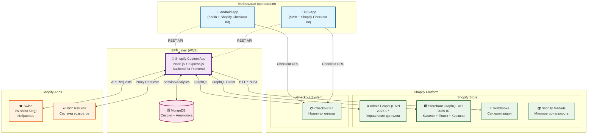

# Техническая и функциональная спецификация
## Shopify Custom App - BFF для мобильного приложения LIME

## Содержание

1. [Обзор проекта](#обзор-проекта)
2. [Архитектура системы](#архитектура-системы)
3. [База данных MongoDB - Упрощенная схема](#база-данных-mongodb---упрощенная-схема)
   - [Магазины (изоляция на уровне магазина)](#магазины-изоляция-на-уровне-магазина)
   - [Сессии пользователей](#сессии-пользователей)
   - [Заказы с идентификацией источника](#заказы-с-идентификацией-источника)
   - [Возвраты из Rich Returns](#возвраты-из-rich-returns)
4. [API Endpoints с логикой работы](#api-endpoints-с-логикой-работы)
   - [Аутентификация и регистрация](#аутентификация-и-регистрация)
   - [Гостевой токен](#гостевой-токен)
   - [Профиль клиента](#профиль-клиента)
   - [Каталог товаров через Storefront API](#каталог-товаров-через-storefront-api)
   - [Поиск через Storefront API](#поиск-через-storefront-api)
   - [Корзина (прямое взаимодействие с Shopify)](#корзина-прямое-взаимодействие-с-shopify)
   - [Wishlist интеграция с Swish](#wishlist-интеграция-с-swish)
5. [Интеграции с третьими сторонами](#интеграции-с-третьими-сторонами)
   - [Rich Returns интеграция](#rich-returns-интеграция)
6. [Webhook обработчики](#webhook-обработчики)
7. [Зона ответственности BFF](#зона-ответственности-bff)
8. [Полный список API Endpoints](#полный-список-api-endpoints)
9. [Оценка времени разработки](#оценка-времени-разработки)
10. [Исключения из MVP](#исключения-из-mvp)
11. [Требования к инфраструктуре AWS](#требования-к-инфраструктуре-aws)

---

## Обзор проекта

Создание Backend for Frontend (BFF) приложения в виде кастомного Shopify приложения на Node.js с MongoDB, которое будет служить промежуточным слоем между мобильным приложением LIME (iOS/Android) и Shopify магазином. 

**Ключевые моменты архитектуры:**
- Получение продуктов напрямую через Storefront API без кэширования
- Поиск и автоподсказки напрямую через Storefront API
- Взаимодействие с корзиной Shopify при первом же действии
- Упрощенная база данных с фокусом на сессии и аналитику

## Архитектура системы



**Технический стек:**
- **Backend**: Node.js + Express.js
- **База данных**: MongoDB 
- **Хостинг**: AWS

## База данных MongoDB 

### Магазины (изоляция на уровне магазина)

```javascript
const ShopSchema = new mongoose.Schema({
  shopifyDomain: { type: String, unique: true, index: true },
  shopifyShopId: String,
  accessToken: String, // Зашифрованный
  storefrontAccessToken: String, // Зашифрованный
  settings: {
    defaultMarket: String, // 'AE', 'SA', etc.
    supportedMarkets: [String],
    defaultLanguage: String
  },
  active: Boolean,
  installedAt: Date,
  updatedAt: Date
});
```

**Логика и обоснование ShopSchema:**
- **Изоляция на уровне магазина** - каждый магазин имеет отдельные настройки и токены
- **Безопасность** - все токены хранятся в зашифрованном виде

### Сессии пользователей

```javascript
const SessionSchema = new mongoose.Schema({
  sessionId: { type: String, unique: true, index: true },
  shopId: { type: String, index: true }, // Ссылка на магазин
  // Пользователь
  customerId: String, // Shopify Customer ID (если авторизован)
  customerAccessToken: String, // Зашифрованный Shopify токен
  isGuest: { type: Boolean, default: true },
  // Региональные настройки
  market: String, // 'AE', 'SA', etc.
  language: String, // 'en', 'ar'
  currency: String, // 'AED', 'SAR'
  // Корзина (опциональное кэширование)
  cartId: String, // Shopify Cart ID
  cartToken: String,
  // Wishlist привязка для гостей
  guestWishlistItems: [String], // Временное хранение для гостей
  // Метаданные сессии
  deviceInfo: {
    platform: String, // 'ios', 'android'
    appVersion: String,
    deviceId: String
  },
  expiresAt: { type: Date, index: { expireAfterSeconds: 0 } },
  createdAt: Date,
  updatedAt: Date
});
```

**Логика и обоснование SessionSchema:**
- **Унифицированные сессии** - объединение гостевых и авторизованных пользователей
- **Региональные настройки** - сохранение предпочтений пользователя
- **Корзина** - опциональное кэширование для оптимизации
- **Wishlist для гостей** - временное хранение до авторизации
- **Метаданные** - информация об устройстве для аналитики

### Заказы с идентификацией источника

```javascript
const OrderSchema = new mongoose.Schema({
  shopId: { type: String, index: true },
  shopifyId: { type: String, unique: true, index: true },
  orderNumber: String,
  customerId: { type: String, index: true },
  sessionId: String, // Связь с сессией
  // Идентификация источника заказа
  sourceChannel: {
    type: String, 
    enum: ['web', 'mobile_app', 'pos'],
    index: true
  },
  sourceDetails: {
    platform: String, // 'ios', 'android'
    appVersion: String,
    deviceId: String,
    sessionId: String
  },
  // Markets данные
  market: String,
  currency: String,
  totalPrice: Number,
  tags: [String],
  // Webhook данные
  webhookData: Object, // Полные данные из webhook
  syncedAt: Date,
  createdAt: Date
});
```

### Возвраты из Rich Returns

```javascript
const ReturnSchema = new mongoose.Schema({
  shopId: { type: String, index: true },
  rma: { type: String, unique: true, index: true },
  orderId: { type: String, index: true }, // Shopify Order ID
  customerId: { type: String, index: true },
  customerEmail: String,
  status: String,
  method: String,
  products: [Object],
  // Rich Returns данные
  richReturnsData: Object, // Полные данные из Rich Returns API
  syncedAt: Date,
  createdAt: Date
});
```

## API Endpoints с логикой работы

### Аутентификация и регистрация

#### POST /api/auth/register

Запрос от мобильного приложения:
```json
{
  "email": "customer@example.com",
  "password": "password123",
  "firstName": "Ahmed",
  "lastName": "Al-Rashid",
  "phone": "+971501234567",
  "market": "AE"
}
```

Ответ BFF приложения:
```json
{
  "success": true,
  "data": {
    "token": "eyJhbGciOiJIUzI1NiIsInR5cCI6IkpXVCJ9...",
    "customer": {
      "id": 555666777,
      "email": "customer@example.com",
      "firstName": "Ahmed",
      "lastName": "Al-Rashid"
    }
  }
}
```

**Логика работы:** BFF создает нового клиента через Shopify Admin GraphQL API customerCreate, затем автоматически авторизует через customerAccessTokenCreate, обновляет сессию с customerId и возвращает JWT токен.

#### POST /api/auth/login

Запрос от мобильного приложения:
```json
{
  "email": "customer@example.com",
  "password": "password123",
  "sessionId": "session_abc123"
}
```

Ответ BFF приложения:
```json
{
  "success": true,
  "data": {
    "token": "eyJhbGciOiJIUzI1NiIsInR5cCI6IkpXVCJ9...",
    "customer": {
      "id": 555666777,
      "email": "customer@example.com",
      "firstName": "Ahmed",
      "lastName": "Al-Rashid"
    }
  }
}
```

**Логика работы:** BFF авторизует через Storefront API, обновляет существующую гостевую сессию с customerId, привязывает корзину и wishlist к клиенту, возвращает JWT токен.

### Гостевой токен

#### POST /api/auth/guest

Запрос от мобильного приложения:
```json
{
  "market": "AE",
  "language": "en",
  "deviceInfo": {
    "platform": "ios",
    "appVersion": "1.2.3",
    "deviceId": "device123"
  }
}
```

Ответ BFF приложения:
```json
{
  "success": true,
  "data": {
    "guestToken": "guest_xyz789",
    }
  }
```

**Логика работы:** BFF создает новую гостевую сессию в MongoDB с региональными настройками и метаданными устройства, возвращает временный токен для неавторизованных операций.

### Профиль клиента

#### GET /api/customer/profile

Запрос мобильного приложения:
```
GET /api/customer/profile
Headers: Authorization: Bearer JWT_TOKEN
```

**Логика работы:** BFF получает актуальные данные клиента напрямую из Shopify Storefront API customer query без кэширования, обогащает региональными настройками из сессии.

#### GET /api/customer/orders

**Логика работы:** BFF запрашивает заказы клиента из MongoDB (синхронизированные через webhooks) с фильтрацией по sourceChannel для показа только мобильных заказов при необходимости.

### Каталог товаров через Storefront API

#### GET /api/collections

**Логика работы:** BFF напрямую запрашивает коллекции из Shopify Storefront API без кэширования, применяет региональные фильтры на уровне запроса через market параметры Shopify Markets.

#### GET /api/collections/:handle/products

**Логика работы:** BFF получает товары коллекции напрямую из Storefront API с пагинацией, фильтрацией по размеру и сортировкой. Региональные цены и доступность обрабатываются автоматически через Shopify Markets.

#### GET /api/products/:handle

**Логика работы:** BFF запрашивает детальную информацию товара напрямую из Storefront API, для авторизованных пользователей проверяет статус в wishlist через Swish API.

### Поиск через Storefront API

#### GET /api/search

**Логика работы:** BFF выполняет поиск напрямую через Shopify Storefront API products query с поисковыми параметрами, без собственного поискового индекса.

#### GET /api/search/autocomplete

**Логика работы:** BFF использует Shopify Storefront API для получения автоподсказок товаров и коллекций по введенному запросу.

### Корзина (прямое взаимодействие с Shopify)

#### POST /api/cart/create

**Логика работы:** BFF сразу создает корзину в Shopify через Storefront API cartCreate, сохраняет cartId в сессии для последующих операций.

#### POST /api/cart/add

**Логика работы:** BFF добавляет товары напрямую в Shopify корзину через cartLinesAdd mutation, опционально кэширует состояние корзины в сессии.

#### GET /api/cart

**Логика работы:** BFF получает актуальное состояние корзины из Shopify через cart query, использует кэш в сессии только для оптимизации.

#### POST /api/checkout/create

**Логика работы:** BFF использует существующую Shopify корзину для генерации checkoutUrl с source attributes для идентификации мобильного приложения.

### Wishlist интеграция с Swish

#### GET /api/wishlist

**Логика работы:** Для авторизованных пользователей BFF получает wishlist из Swish API. Для гостей возвращает временный wishlist из сессии.

#### POST /api/wishlist/add

**Логика работы:** Для авторизованных пользователей добавляет в Swish. Для гостей сохраняет в guestWishlistItems сессии до авторизации.

**Привязка после авторизации:** При логине BFF автоматически переносит товары из guestWishlistItems в Swish wishlist клиента.

## Интеграции с третьими сторонами

### Rich Returns интеграция

#### GET /api/customer/returns

**Логика работы:** BFF получает возвраты клиента из локальной базы данных (синхронизированные через API Rich Returns), обогащает данными заказов и возвращает форматированный список.

**Привязка возвратов к заказам:** BFF периодически синхронизирует данные из Rich Returns API и связывает возвраты с заказами по orderId для единого представления в мобильном приложении.

## Webhook обработчики

### POST /webhooks/orders/create

**Логика обработки:** 
1. Сохранение заказа в MongoDB с полными данными webhook
2. Автоматическое добавление тегов mobile_app через Admin GraphQL API при обнаружении source_name
3. Извлечение метаданных сессии из note_attributes для аналитики

## Зона ответственности BFF

**BFF сервис отвечает за:**

1. **Реализация авторизированного доступа** к Admin, Storefront и другим API
2. **Предоставление единого фасада** для взаимодействия с Shopify и сторонними сервисами
3. **Управление пользовательскими сессиями** и их унификация
4. **Хранение пользовательских настроек** по региону и прочих предпочтений
5. **Взаимодействие с приложениями** в контексте текущей пользовательской сессии
6. **Авторизация пользователя** и привязка к гостевой сессии после успешной авторизации
7. **Привязка возвратов** из стороннего приложения к заказам пользователя
8. **Кэширование содержимого корзины** (опционально, нужно для оптимизации)
   

**BFF в первой версии НЕ отвечает за:**
- Кэширование товаров и коллекций (получение напрямую из Storefront API)
- Собственный поисковый индекс (поиск через Shopify)
- Обогащенное содержимое меню (получение через Storefront API)
- Хранение состояния корзины отдельно от Shopify
- Предоставление контента, которые не относится к продуктовым данным
  

## Полный список API Endpoints

### Аутентификация
- `POST /api/auth/register` - Регистрация нового пользователя
- `POST /api/auth/login` - Авторизация пользователя
- `POST /api/auth/guest` - Получение гостевого токена
- `POST /api/auth/logout` - Выход из системы

### Профиль клиента
- `GET /api/customer/profile` - Получение данных профиля
- `PUT /api/customer/profile` - Обновление профиля
- `GET /api/customer/addresses` - Список адресов
- `POST /api/customer/addresses` - Добавление адреса
- `PUT /api/customer/addresses/:id` - Обновление адреса
- `DELETE /api/customer/addresses/:id` - Удаление адреса
- `GET /api/customer/orders` - История заказов с фильтрацией по источнику
- `GET /api/customer/orders/:id` - Детали заказа
- `GET /api/customer/returns` - Список возвратов с привязкой к заказам

### Каталог товаров
- `GET /api/collections` - Список коллекций
- `GET /api/collections/:handle/products` - Товары коллекции с фильтрацией по размеру
- `GET /api/products/:handle` - Детальная страница товара с рекомендованными товарами

### Поиск товаров
- `GET /api/search` - Полнотекстовый поиск товаров
- `GET /api/search/autocomplete` - Автокомплит для поисковой строки

### Корзина и checkout
- `POST /api/cart/create` - Создание корзины с привязкой к сессии
- `POST /api/cart/add` - Добавление товара в корзину
- `PUT /api/cart/update` - Обновление количества в корзине
- `DELETE /api/cart/remove` - Удаление товара из корзины
- `GET /api/cart` - Получение корзины с добавлением атрибутов
- `POST /api/checkout/create` - Создание checkout URL

### Wishlist (интеграция с Swish)
- `GET /api/wishlist` - Получение избранного с привязкой к гостевой сессии
- `POST /api/wishlist/add` - Добавление в избранное
- `DELETE /api/wishlist/remove/:productId` - Удаление из избранного

### Контент
- `GET /api/menu/navigation` - Получение меню

### Политики возврата
- `GET /api/returns/policies` - Получение политик возврата

## Оценка времени разработки

| Функционал | Оценочное время (ч) |
|------------|-------------------|
| **Shopify приложение** | |
| - Установка, авторизация приложения, реализация скелета и сущности shop, изоляция на уровне магазина | 24 |
| **Авторизация/Регистрация/Управление сессиями** | |
| - Управление сессиями пользователей (сущность сессии, время жизни, выпуск и валидация токенов, настройки региона) | 24 |
| - Логин, Регистрация, привязка гостевой сессии после авторизации, привязка корзины и вишлиста, логаут | 20 |
| **Профиль клиента** | |
| - Получение данных профиля, редактирование данных профиля | 10 |
| - Добавление, редактирование, удаление адресов, список адресов | 10 |
| - Получение списка заказов, фильтрация по источнику, получение деталей заказа | 8 |
| - Получение списка возвратов из приложения, авторизация API, привязка возвратов к заказам, получение политик | 18 |
| **Каталог товаров** | |
| - Получение списка коллекций | 5 |
| - Получение списка продуктов в коллекции, фильтрация по размеру, постраничная навигация | 12 |
| - Получение деталей продукта, получение рекомендованных продуктов | 8 |
| - Получение вишлиста, добавление/удаление из вишлиста, привязка к гостевой сессии, авторизация API приложения | 18 |
| **Поиск** | |
| - Получение автоподсказок по введенному запросу | 6 |
| - Получение результатов поиска по запросу, постраничная навигация | 12 |
| **Корзина** | |
| - Создание корзины, привязка к текущей сессии, получение корзины, добавление атрибутов | 18 |
| - Добавление, удаление продукта, изменение количества, создание чекаута | 14 |
| **Обработка заказов** | |
| - Добавление тегов в созданные заказы, хранение истории заказов и возвратов в БД | 10 |
| **Контент** | |
| - Получение меню | 4 |
| **Остальное** | |
| - Развёртывание и настройка дев окружения | 6 |
| - Тестирование и исправление проблем | 30 |
| - Обработка ошибок API, логирование в CloudWatch | 12 |
| - Развёртывание и настройка БД, резервное копирование (MongoDB) | 6 |
| - Подготовка и развёртывание прод окружения (AWS), настройка мониторинга | 30 |
| - Настройка автоматического развёртывания | 14 |
| - Описание и генерация API документации | 20 |
| **Общее время** | **339 часов** |

## Исключения из MVP

**Пока НЕ оцениваем/не делаем:**
- Получение статического контента по маркетам включая админку для управления
- Endpoint для refresh токена (заменен на гостевой токен)
- Нагрузочное тестирование
- CloudFront CDN
- Push уведомления
- Получение статических страниц
- Featured products как отдельный endpoint

## Требования к инфраструктуре AWS

### Серверная архитектура
- **Application Server**: AWS EC2 или ECS для Node.js приложения
- **Database**: AWS instance c Mongo Atlas (MongoDB-совместимый) для сессий и аналитики
- **Load Balancer**: AWS Application Load Balancer для распределения нагрузки
- **SSL**: AWS Certificate Manager для HTTPS

### Безопасность и мониторинг
- **Secrets Management**: AWS Secrets Manager для API ключей
- **Logging**: AWS CloudWatch для логирования и мониторинга
- **Backup**: Автоматические backups MongoDB
- **Scaling**: Auto Scaling Groups для автомасштабирования

## Заключение

Данная техническая спецификация отражает архитектуру BFF приложения с фокусом на прямое взаимодействие с Shopify Storefront API и минимальным кэшированием. 

Система спроектирована для быстрой разработки с использованием встроенных возможностей Shopify для каталога, поиска и корзины, при этом BFF сосредоточен на управлении сессиями, интеграциях с третьими сторонами и аналитике мобильных заказов.
